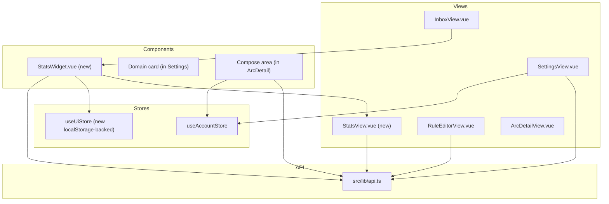

# Design Document

## Overview

Six frontend features added to the email-catcher Vue 3 SPA. All use existing backend APIs (with some backend TODOs for full support). Chart rendering via ECharts (tree-shaken). State persisted via Pinia + localStorage. No new dependencies beyond ECharts + vue-echarts.

## Dependencies

- `echarts` (tree-shaken: `pie`, `line`, `grid`, `tooltip` modules only)
- `vue-echarts` (Vue 3 wrapper, auto-resizes)
- No other new dependencies

## Architecture



## Component Design

### R1: StatsWidget.vue

New component rendered at top of `InboxView.vue` inside a collapsible accordion.

```vue
<script setup lang="ts">
import { computed, onMounted, ref } from 'vue'
import VChart from 'vue-echarts'
import { use } from 'echarts/core'
import { PieChart, LineChart } from 'echarts/charts'
import { GridComponent, TooltipComponent } from 'echarts/components'
import { CanvasRenderer } from 'echarts/renderers'
import { useUiStore } from '@/stores/ui'
import { useAccountStore } from '@/stores/account'
import { api } from '@/lib/api'
import { useRouter } from 'vue-router'

use([PieChart, LineChart, GridComponent, TooltipComponent, CanvasRenderer])

const uiStore = useUiStore()
const accountStore = useAccountStore()
const router = useRouter()
const stats = ref<StatsResponse | null>(null)
const loading = ref(true)

onMounted(async () => { /* fetch stats */ })
</script>
```

**Layout:** `flex` row — donut (80×80) | "View full stats →" link below donut | totals column | stacked area chart (flex:1).

**Accordion:** `uiStore.statsWidgetExpanded` (boolean, localStorage-persisted). Chevron toggle.

**Click:** Entire widget is a `<router-link :to="{ name: 'stats' }">` wrapping the content.

### R1: StatsView.vue

New view registered at route `/stats`. Full-page ECharts instance showing:
- Large stacked area chart (daily last 365 days)
- Below: monthly bars for older data
- Totals summary at top

Fetches `GET /accounts/:id/stats` on mount. Loading skeleton while pending. Error state with retry button.

### R1: useUiStore

New Pinia store for UI preferences persisted to localStorage:

```ts
export const useUiStore = defineStore('ui', () => {
  const statsWidgetExpanded = ref(
    JSON.parse(localStorage.getItem('ses:ui:statsExpanded') ?? 'true')
  )
  watch(statsWidgetExpanded, (v) => localStorage.setItem('ses:ui:statsExpanded', JSON.stringify(v)))
  return { statsWidgetExpanded }
})
```

### R2: Forwarding verification in SettingsView

In the forwarding tab's `onMounted` (or a `watch` on route query):

```ts
const route = useRoute()
const verifyAddress = route.query.verifyAddress as string | undefined
const verifyToken = route.query.token as string | undefined

if (verifyAddress && verifyToken && accountStore.accountId) {
  const result = await api.verifyForwardingAddress(accountStore.accountId, verifyAddress, verifyToken)
  if (result.isOk()) {
    showToast('✓ ' + verifyAddress + ' verified')
    await loadForwardingAddresses()
  } else {
    verifyError.value = result.error.message
  }
  // Strip query params after processing
  router.replace({ ...route, query: { ...route.query, verifyAddress: undefined, token: undefined } })
}
```

The `accountId` query param is handled by the global route guard (already wired via `fetchAccount(fromAccountId)`).

### R3: Domain delete button

Add to each domain card in Settings → Domains tab:

```vue
<button @click="confirmDeleteDomain(domain)">
  <TrashIcon />
</button>
```

Uses existing `ConfirmDialog` with destructive variant. On confirm: `api.deleteDomain(accountId, domain.domainId)` → remove from local `domains` array.

**API client addition:**
```ts
deleteDomain(accountId: string, domainId: string): Promise<Result<void, ApiError>>
```

### R4: Webhook action in RuleEditor

Add `webhook` to the action type options array. When selected, render:

```vue
<input v-if="action.type === 'webhook'" type="url" v-model="action.value" placeholder="https://example.com/webhook" />
<AsyncButton v-if="action.type === 'webhook'" :action="() => testWebhook(action.value)">Test</AsyncButton>
<span v-if="webhookTestResult" :class="webhookTestResult.ok ? 'text-ctp-green' : 'text-ctp-red'">
  {{ webhookTestResult.ok ? '✓ 200 OK' : `✗ ${webhookTestResult.status}` }}
</span>
```

**Test function:**
```ts
async function testWebhook(url: string) {
  const key = crypto.randomUUID().replace(/-/g, '').slice(0, 12)
  const payload = { [key]: `This test webhook request was generated by ${accountStore.account?.accountId}` }
  const res = await fetch(url, { method: 'POST', headers: { 'Content-Type': 'application/json' }, body: JSON.stringify(payload) })
  webhookTestResult.value = { ok: res.ok, status: res.status }
}
```

### R5: Retention duration in Settings

In the Email tab (renamed from "Compose"), add a dropdown:

```vue
<select v-model="selectedRetention" @change="updateRetention">
  <option v-for="opt in retentionOptions" :key="opt.value" :value="opt.value" :disabled="!opt.available">
    {{ opt.label }} {{ opt.badge ? `(${opt.badge})` : '' }}
  </option>
</select>
```

**Options derived from plan:**
```ts
const RETENTION_OPTIONS = [
  { value: 'P1M', label: '1 month', minPlan: 'Free' },
  { value: 'P2M', label: '2 months', minPlan: 'Free' },
  { value: 'P3M', label: '3 months', minPlan: 'Free' },
  { value: 'P5M', label: '5 months', minPlan: 'Free' },
  { value: 'P6M', label: '6 months', minPlan: 'Free' },
  { value: 'P1Y', label: '1 year', minPlan: 'Pro' },
  { value: 'P2Y', label: '2 years', minPlan: 'Pro' },
  { value: 'P5Y', label: '5 years', minPlan: 'Pro' },
  { value: 'P10Y', label: '10 years', minPlan: 'Pro' },
  { value: 'Infinity', label: 'Forever', minPlan: 'Premium' },
]
```

Unavailable options show a lock icon + plan badge. Clicking them shows upgrade prompt.

### R6: Post-send intent buttons

In the compose area (ArcDetailView signal composer), replace the single Send button:

```vue
<div class="flex gap-2">
  <AsyncButton
    :action="() => sendAndArchive()"
    :class="afterSendAction === 'archive' ? 'bg-ctp-mauve' : 'border-ctp-surface1'"
  >
    Send + Archive
  </AsyncButton>
  <AsyncButton
    :action="() => sendAndWait()"
    :class="afterSendAction !== 'archive' ? 'bg-ctp-mauve' : 'border-ctp-surface1'"
  >
    Send + Wait
  </AsyncButton>
</div>
```

**Functions:**
```ts
async function sendAndArchive() {
  await api.sendSignal(accountId, signalId)
  await api.updateArc(accountId, arcId, { status: 'archived' })
}

async function sendAndWait() {
  await api.sendSignal(accountId, signalId)
  const followupAt = DateTime.utc().plus({ days: 7 }).toISO()
  await api.updateArc(accountId, arcId, { followupAt })
}
```

## Route Changes

```ts
// Add to router/index.ts children array:
{
  path: 'stats',
  name: 'stats',
  component: () => import('@/views/StatsView.vue'),
}
```

No sidebar item — only accessible via StatsWidget click.

## API Client Additions

```ts
// In src/lib/api.ts:
getStats(accountId: string): Promise<Result<StatsResponse, ApiError>>
deleteDomain(accountId: string, domainId: string): Promise<Result<void, ApiError>>
verifyForwardingAddress(accountId: string, address: string, token: string): Promise<Result<void, ApiError>>
```

## Global Route Guard Update

In `router.beforeEach`, add `accountId` query param detection:

```ts
router.beforeEach(async (to, from, next) => {
  const queryAccountId = to.query.accountId as string | undefined
  if (queryAccountId) {
    accountStore.startFetch(queryAccountId)
    // Strip accountId from query to avoid re-processing
    const { accountId: _, ...rest } = to.query
    return next({ ...to, query: rest, replace: true })
  }
  // ... existing auth guard logic
})
```

## Tab Rename

Settings "Compose" tab renamed to "Email". The `afterSendAction` toggle stays, joined by the retention duration dropdown.

## ECharts Configuration

### Widget (donut)
```ts
{ type: 'pie', radius: ['55%', '85%'], emphasis: { scale: true, scaleSize: 4 }, tooltip: { trigger: 'item', confine: true } }
```

### Widget (stacked area)
```ts
{ type: 'line', stack: 'total', areaStyle: { opacity: 0.4 }, smooth: true, symbol: 'none' }
```

### Full stats view
Same series config but with `xAxis` visible (date labels), tooltip with axis trigger, and responsive height.

## Colors (Catppuccin Mocha)

| Category | Variable | Hex |
|----------|----------|-----|
| Allowed | `--ctp-green` | #a6e3a1 |
| Quarantined | `--ctp-yellow` | #f9e2af |
| Blocked | `--ctp-red` | #f38ba8 |
| Interactive | `--ctp-mauve` | #cba6f7 |
