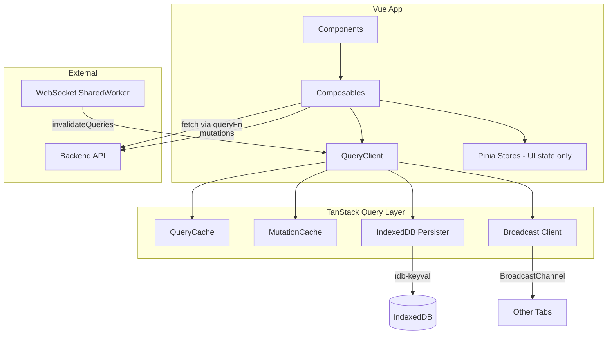

# Design Document: TanStack Query Migration

## Overview

Replace the remaining hand-rolled Pinia fetch/cache plumbing with @tanstack/vue-query v5 composables. The migration is already substantially complete — `queryClient.ts`, `queryKeys.ts`, `queryRetry.ts`, and per-resource composables (`useThreadQueries`, `useQuarantineQueries`, `useSpamQueries`, etc.) are in place. This design documents the architecture that has been established and the remaining wiring needed to satisfy all 14 requirements.

The core principle: TanStack Query owns all server-state (fetch, cache, stale-while-revalidate, persistence, multi-tab sync). Pinia retains only client-side UI state (selection, action-pending flags, computed derivations that don't map to a fetch).

## Architecture



**Data flow:**
1. Components call composables (e.g. `useThreadListQuery`)
2. Composables declare queries/mutations via TanStack hooks
3. QueryClient manages cache, deduplication, stale-time, retry
4. Persister serializes cache to IndexedDB (debounced, async)
5. BroadcastClient propagates invalidations across tabs
6. WebSocket SharedWorker pushes real-time events → `useRealtime` calls `invalidateQueries`

## Components and Interfaces

### Query Client (`src/lib/queryClient.ts`)

Single `QueryClient` instance, created at module scope, passed to `VueQueryPlugin`. Configures:
- Default query options (staleTime, gcTime, retry, refetch behaviors)
- Default mutation options (retry)
- QueryCache with global onError → logger
- MutationCache with global onError → logger
- Persister (IndexedDB via `experimental_createQueryPersister`)
- BroadcastClient (wrapped in try/catch for environments without BroadcastChannel)

### Query Key Factory (`src/lib/queryKeys.ts`)

Centralized key builders returning `readonly` tuples. Structure:
```
queryKeys.{resource}.all(accountId)       → [resource, accountId]
queryKeys.{resource}.list(accountId, ...) → [resource, accountId, ...filters]
queryKeys.{resource}.detail(accountId, id)→ [resource, accountId, id]
```

The `.all()` method doubles as the partial-key for `invalidateQueries({ queryKey: ... })` prefix matching.

### Retry Function (`src/lib/queryRetry.ts`)

Pure function `shouldRetry(failureCount, error)` shared by queries and mutations:
- Returns `false` if `failureCount >= 3`
- Returns `true` for network errors (status 0) and 5xx
- Returns `false` for 4xx (client errors)
- Returns `failureCount < 1` for unknown error types (single safety retry)

### Resource Composables (`src/composables/use*Queries.ts`)

Each resource has a composable exporting:
- Query hooks (useInfiniteQuery for lists, useQuery for details)
- Mutation hooks with optimistic update → rollback → invalidation pattern
- Computed properties derived from query data (flattened pages, counts, hasMore)

| Composable | Resource | Query Type |
|-----------|----------|-----------|
| `useThreadQueries` | threads | infinite (list), standard (detail) |
| `useSignalQueries` | signals | infinite (by thread) |
| `useQuarantineQueries` | quarantine | infinite (visible + hidden) |
| `useSpamQueries` | spam | infinite (hidden + reject) |
| `useStatsQuery` | stats | standard |
| `useRulesQueries` | rules | standard |
| `useLabelsQueries` | labels | standard |

### Pinia Stores (retained)

| Store | Retained State |
|-------|---------------|
| `threads` | `selectedIds`, `bulkActionPending`, `toggleSelect`, `selectAll`, `clearSelection` |
| `quarantine` | `actionPending` |
| `spam` | `actionPending` |
| `account` | Full store — account selection, switching, auth (no TanStack delegation) |
| `theme`, `ui`, `shortcuts`, `userConfig`, `logs` | Unchanged — not server-cache concerns |

### Real-Time Layer (`src/composables/useRealtime.ts`)

SharedWorker maintains a WebSocket connection. On incoming events:
- `thread:updated` → invalidates `threads.all(accountId)`, `threads.detail(accountId, threadId)`, `signals.byThread(accountId, threadId)`

Invalidation marks queries stale; only active observers refetch immediately. No polling fallback — stale triggers (mount, focus, reconnect) provide eventual consistency.

## Data Models

### Query Key Shapes

```typescript
// Threads
['threads', accountId]                        // all (prefix match)
['threads', accountId, { status }]            // filtered list
['threads', accountId, threadId]              // detail

// Signals
['signals', accountId]                        // all
['signals', accountId, threadId]              // by thread

// Quarantine
['quarantine', accountId]                     // all (prefix match)
['quarantine', accountId, { sender?, after?, before? }, variant] // filtered

// Spam
['spam', accountId]                           // all (prefix match)
['spam', accountId, { sender?, after?, before? }, variant]       // filtered

// Stats
['stats', accountId]

// Other resources follow the same [resource, accountId, ...params] pattern
```

### Infinite Query Page Shape

```typescript
interface InfinitePage<T> {
  items: T[]          // resource-specific field name (threads, signals, etc.)
  pagination: { cursor: string | null }
}
```

### Persister Configuration

```typescript
{
  storage: { getItem: idbGet, setItem: idbSet, removeItem: idbDel },
  maxAge: 30 * 24 * 60 * 60 * 1000,  // current: 30 days — req specifies 7 days
  prefix: `ses:${buildCommit}:`,
  buster: buildCommit,
}
```

**Gap:** Requirements specify 7-day maxAge. Current implementation uses 30 days. This should be reconciled — either update the code to 7 days or update the requirement to 30 days.

## Correctness Properties

*A property is a characteristic or behavior that should hold true across all valid executions of a system — essentially, a formal statement about what the system should do. Properties serve as the bridge between human-readable specifications and machine-verifiable correctness guarantees.*

### Property 1: Retry decision correctness

*For any* HTTP status code (0, or in range 100–599) and failure count (0–10), `shouldRetry(failureCount, error)` SHALL return `true` only when the error is a network error (status 0) or server error (status >= 500), AND failureCount < 3. For any 4xx error it SHALL return `false` regardless of failure count.

**Validates: Requirements 1.3, 1.4**

### Property 2: Query key structural correctness

*For any* accountId string and resource type, the key factory's `all(accountId)` function SHALL return a readonly tuple whose first element is the resource name string and second element is the provided accountId. List and detail builders SHALL also contain accountId at index 1.

**Validates: Requirements 5.1, 12.1, 12.3**

### Property 3: Query key determinism and filter handling

*For any* pair of filter parameter objects with the same accountId and resource type, calling the key factory with identical defined filter values SHALL produce deeply-equal key arrays, and calling it with any differing defined value SHALL produce non-equal key arrays. Parameters whose value is `undefined` or `null` SHALL be excluded from the produced key.

**Validates: Requirements 12.2, 12.4**

### Property 4: Cursor extraction

*For any* page response object containing `pagination: { cursor: string | null }`, the `getNextPageParam` function SHALL return the cursor value when it is a non-empty string, and SHALL return `undefined` when cursor is `null` or `undefined`.

**Validates: Requirements 6.2, 6.5**

## Error Handling

| Scenario | Handling |
|----------|----------|
| Query fetch fails (5xx/network) | Retry up to 3 times with exponential backoff. After exhaustion: cache retains previous data, isError=true, global onError logs. |
| Query fetch fails (4xx) | No retry. isError=true immediately. Global onError logs. |
| Mutation fails | Retry up to 3 for 5xx/network. On failure: rollback optimistic update (onError context), invalidate queries (onSettled) for reconciliation. Global mutation onError logs. |
| IndexedDB unavailable | Persister fails silently (try/catch in idb-keyval), app starts with empty cache. |
| BroadcastChannel unavailable | `broadcastQueryClient` wrapped in try/catch — single-tab mode, no error surfaced. |
| WebSocket disconnect | No polling fallback. Standard stale triggers (mount, focus, reconnect) provide eventual consistency. |

All errors flow through the global QueryCache/MutationCache onError handlers → `logger.error`. Components access per-query `isError` and `error` reactively for UI feedback. No `throwOnError` — errors stay in reactive state.

## Testing Strategy

**Unit tests (Vitest):**
- `shouldRetry` — specific examples for each error class (4xx, 5xx, network, unknown) and boundary failure counts
- `queryKeys` factory — specific examples for each resource type, filter inclusion/exclusion
- `getNextPageParam` — examples with null cursor, valid cursor
- Optimistic update logic — pre-populate cache, fire mutation, assert cache state
- Rollback logic — fire mutation, simulate failure, assert previous state restored
- Invalidation wiring — fire mutation settle, assert correct keys invalidated
- Global error handlers — spy on logger, trigger failures, assert log shape
- BroadcastChannel unavailability — delete API, verify no throw

**Property tests (Vitest + fast-check):**
- `shouldRetry` — generate (failureCount ∈ [0, 10], status ∈ {0, 100–599}) → verify decision matches Property 1
- `queryKeys` determinism — generate random accountId + filters → verify identical inputs = identical keys, different inputs ≠ identical keys (Property 3)
- `queryKeys` structure — generate random accountId → verify tuple shape and accountId position (Property 2)
- `getNextPageParam` — generate random `{ pagination: { cursor: string | null } }` → verify extraction (Property 4)

Each property test runs minimum 100 iterations. Each test references its design property:
```typescript
// Feature: tanstack-query-migration, Property 1: Retry decision correctness
```

**Integration tests (Playwright):**
- Tab focus → refetch fires (verify network request after visibility change)
- Persisted cache restoration on reload

**Not tested via PBT (rationale):**
- Requirements 2.x (persistence) — tests IndexedDB library behavior, config-verified
- Requirements 3.x (broadcast) — tests external library over BroadcastChannel
- Requirements 7.x, 9.x (stale-while-revalidate, deduplication) — library behavior, config-verified
- Requirements 8.x (optimistic mutations) — example-based tests with specific scenarios (not universally quantifiable)
- Requirements 11.x (retained Pinia stores) — architecture assertions, example-based
